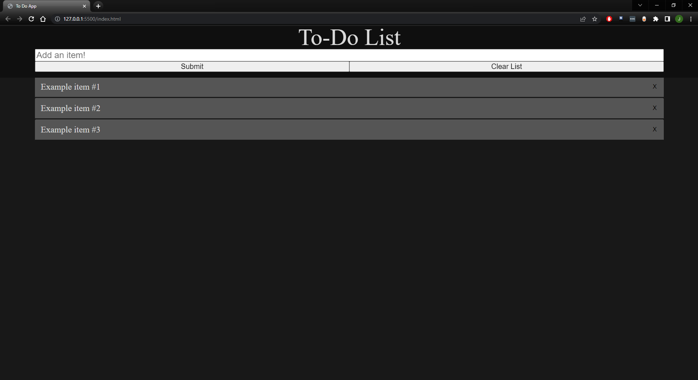
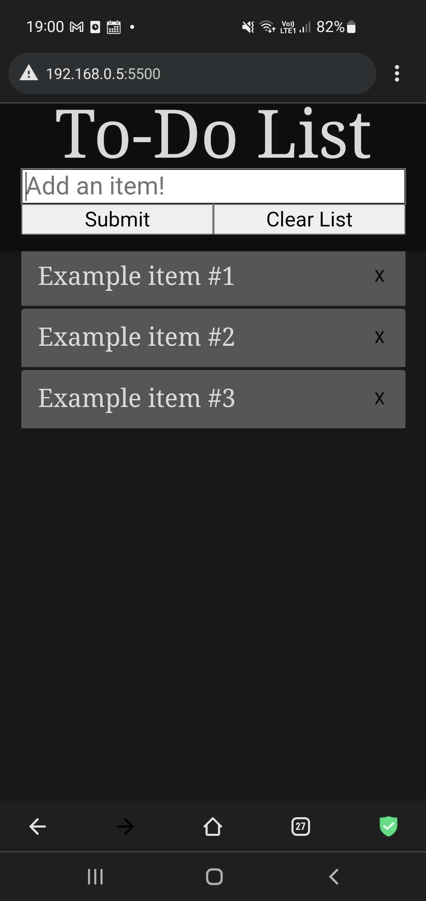

# To-Do-List
A simple to-do list made with HTML, CSS, and JavaScript.

The project was done for the purpose of helping me learn practical JavaScript.

Functionality includes adding and removing list items, individually or via the "Clear List" button. 
"Enter" creates a list item and the input field is refocussed in order to help minimise needless user inputs.
The header is also fixed to the top of the viewport, and scrolls with the user in order to allow creating entries while viewing a long list of items.

